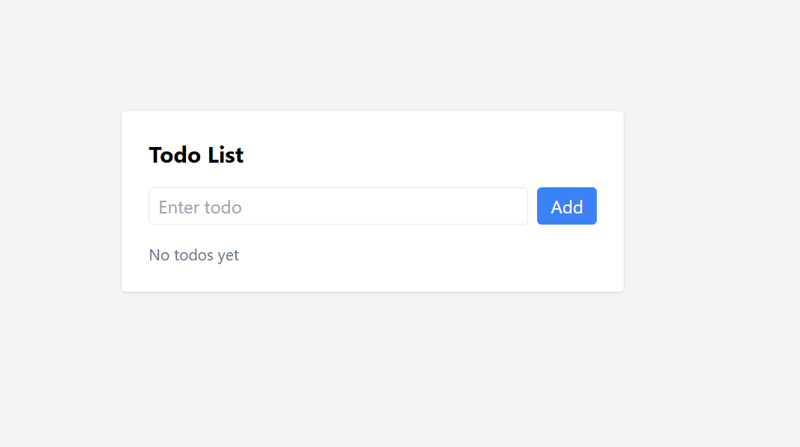
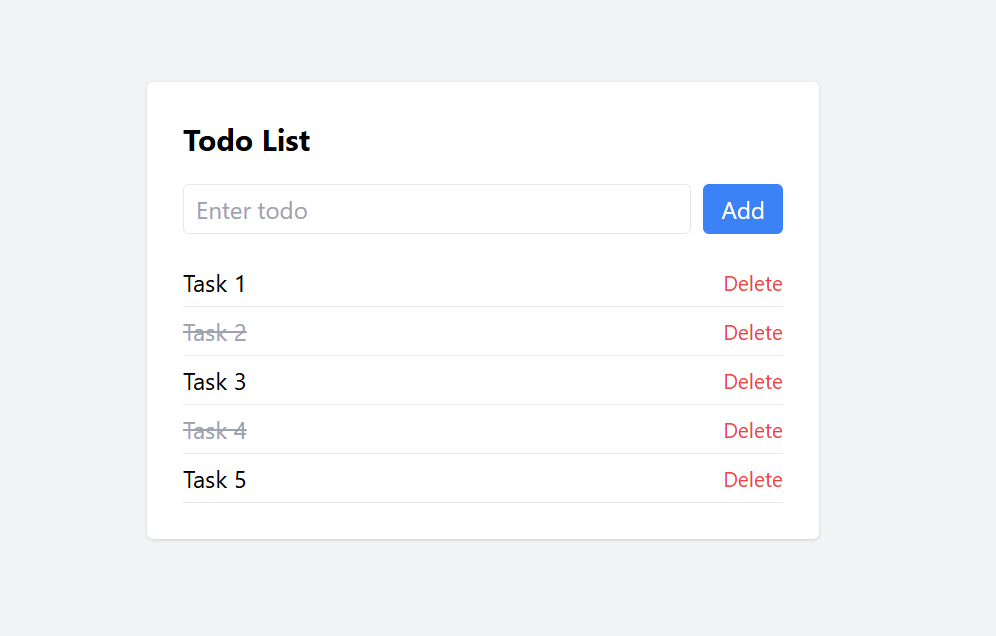

## React From Scratch

This repository contains React projects built after completing core JavaScript logic practice.
Focus is on understanding state, rendering, and data flow.

# (1) Todo App

Live Demo: <https://dolistappp.netlify.app/>

## Features:

- Add / toggle / delete todos
- Persistent storage using localStorage
- Enter key support
